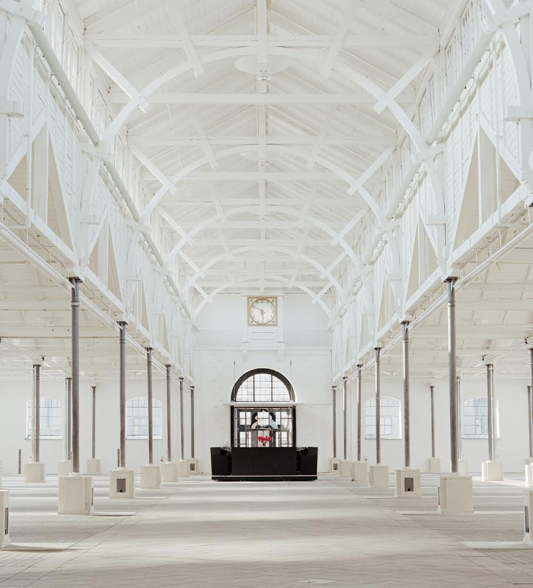
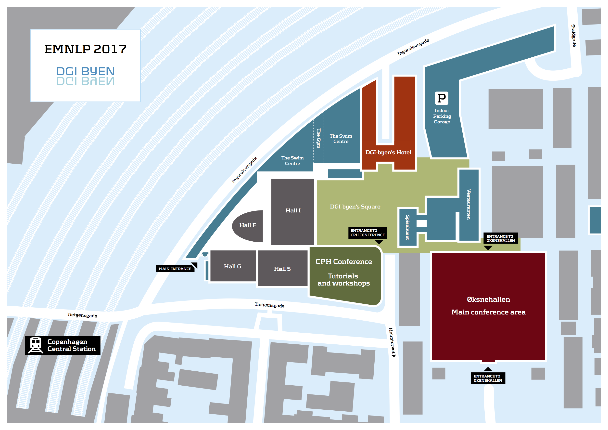

  <h2>Venue</h2>

  <h4>Øksnehallen</h4>
  

    

      
Øksnehallen is centrally located in Copenhagen in the hub of Vesterbro – withdrawn from the noise from traffic in urban and tranquil surroundings. Øksnehallen is more than 100 years old and was originally a part of the old meatpacking industry.

      <h4>Vesterbro, Kødbyen and recreational activities</h4>

      
DGI-byen and Øksnehallen is located in the old meatpacking industry. Today this area of Copenhagen is buzzing and vibrant with an urban and creative feel. Locals and young professionals in general meet up in Vesterbro and Kødbyen to eat or have a drink at the local brewery – Mikkeller beer.

      
The area offers a great variety of ethnic and traditional restaurants and cafes with food from all corners of the world at affordable prices.

      
DGI-byen has the best swimming-pool in Copenhagen (as voted by the guests) and all conference delegates have free access to the facilities. Next to the the swimming-pool is a small gym.

      
Should any of the guests wish to explore the city by bicycle these can be rented from the hotel at affordable prices.

    

    

      
    

  

<h4>Central location</h4>

DGI-byen and Øksnehallen offers an optimal infrastructure which significantly eases the journey and travel-time for the delegates. We are located merely 50m from Copenhagen central station which has direct trains to and from Copenhagen international airport. Your guests will not have to change trains or take busses
but can catch a direct train from the airport to the central station and after a short walk they will be at the venue.

